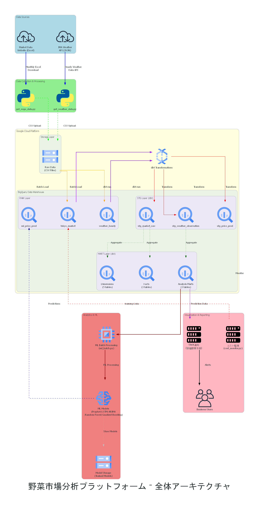

# アーキテクチャ設計書

## 文書情報
- **対象システム**: 野菜市場分析プラットフォーム

## 1. システム概要

### 1.1 機能概要
東京都中央卸売市場の野菜取引データと気象庁の観測データを統合した、野菜価格変動分析プラットフォーム。

### 1.2 主要機能
- 東京都WebサイトからのExcelファイル自動取得
- 気象庁APIからの気象データ取得
- データの正規化・クリーニング処理
- BigQueryへの構造化データ保存
- 市場・気象統合データマートの構築
- 野菜価格予測
- Slack通知
- 月次バッチ処理
- 無料枠運用保証のためのコスト制御

## 2. アーキテクチャ概要

### 2.1 全体アーキテクチャ



*野菜市場分析プラットフォームの全体アーキテクチャ。データソースからクラウドインフラ、分析・可視化層まで包括的な構成を示しています。*

### 2.2 包括的データフロー


*野菜市場分析プラットフォームの包括的データフロー図。データソースから最終的なダッシュボードまでの全体的な流れを示しています。*

### 2.3 技術スタック

| レイヤー | 技術・サービス | 役割 |
|---------|-------------|------|
| **市場データ収集** | Python 3.11, requests, BeautifulSoup | Webスクレイピング・Excel処理 |
| **気象データ収集** | Python 3.11, requests, JMA obsdl API | 気象庁API認証・時別データ取得 |
| **データ保存** | Google Cloud Storage | 生データ保存 |
| **データウェアハウス** | Google BigQuery | 構造化データ保存・分析 |
| **データ変換** | dbt | ETL処理・統合データモデリング |
| **機械学習** | Prophet,ARIMA,LSTM | 時系列価格予測 |
| **通知システム** | Slack API | 安価野菜予測通知 |
| **バッチ処理** | GitHub Actions | 月次自動実行 |
| **インフラ管理** | Terraform | インフラ、リソース管理 |
| **コンテナ** | Docker | 実行環境統一 |
| **認証** | Google Service Account | GCP API認証 |

## 3. コンポーネント設計

### 3.1 市場データ収集コンポーネント

#### 3.1.1 概要
`scripts/get_vege_data.py`が担当するWebスクレイピング処理

#### 3.1.2 主要処理フロー
1. **URL解析**: 東京都Webサイトからファイルリンク抽出
2. **ファイル取得**: Excel形式データのダウンロード
3. **CSV出力**: GCSフォルダに保存
4. **BigQuery読み込み**:テーブルに構造化データ保存

#### 3.1.3 技術詳細
```python
# 主要ライブラリ
- requests: HTTP通信
- BeautifulSoup: HTML解析
- pandas: データ処理
- google-cloud-storage: GCS操作
- google-cloud-bigquery: BigQuery操作
```

### 3.2 気象データ収集コンポーネント

#### 3.2.1 概要
`scripts/get_weather_data.py`が担当する気象庁APIからのデータ取得

#### 3.2.2 主要処理フロー
1. **データ取得**: APIデータ取得
2. **CSV出力**: GCSフォルダに保存
3. **BigQuery読み込み**:テーブルに構造化データ保存

### 3.3 機械学習予測コンポーネント

#### 3.3.1 概要
`scripts/ml_batch.py`、`scripts/ml_time_series.py`、`scripts/ml_price.py`が担当する価格予測システム

#### 3.3.2 主要処理フロー
1. **データ抽出**: BigQueryから市場・気象データを取得
2. **モデル訓練**: ARIMA、Prophet、LSTMの並列学習
3. **予測実行**: 6ヶ月先までの価格予測
4. **結果保存**: BigQuery・GCSへの予測結果・モデル保存

### 3.4 Slack通知コンポーネント

#### 3.4.1 概要
`scripts/slack_notif.py`が担当する安価野菜価格予測の自動通知システム

#### 3.4.2 主要処理フロー
1. **Slack送信**: Webhook APIによる通知送信

### 3.5 データ変換コンポーネント (dbt)

#### 3.3.1 概要
dbtを使用した宣言的データ変換・品質管理・統合データモデリング

#### 3.3.2 レイヤー構成


*dbt変換レイヤーの詳細なアーキテクチャ。ディメンション、ファクト、マートテーブルの構成を示しています。*

#### 3.3.3 dbt変換フロー詳細


*dbt変換レイヤーにおけるRAW→STG→MARTの詳細な変換プロセスを示しています。*

#### 3.3.4 データ品質管理
- **テスト定義**: schema.ymlでデータ品質テスト定義

### 3.4 インフラストラクチャ

| リソース種別 | 用途 | 設定 |
|-------------|------|------|
| **Cloud Storage** | 生データ保存 | - リージョン: us-central1<br>|
| **BigQuery Dataset** | データウェアハウス | - ロケーション: US<br>- 3層構成 (raw/stg/mart) |
| **Service Account** | API認証 | - BigQuery Admin<br>- Storage Admin |

## 4. データパイプライン設計

### 4.1 データパイプライン詳細


*データ収集・処理・変換の詳細なパイプライン構成。各層の役割と処理フローを階層別に表現しています。*

### 4.2 実行スケジュール
- **市場データ収集**: 月次
- **気象データ収集**: 月次
- **dbt変換**: データ収集後トリガー実行
- **ML価格予測バッチ**: dbt変換後自動実行
- **Slack通知**: ML予測完了後自動実行
- **品質チェック**: 各段階完了後自動実行

## 5. セキュリティ設計

### 5.1 認証・認可
- **Service Account**: 最小権限の原則
- **環境変数**: 機密情報の環境変数管理
- **アクセス制御**: IAMロールベース制御

## 6. コスト制御・使用量監視システム

### 6.1 システム概要


*無料枠運用保証のための多重安全装置システム。BigQueryとCloud Storageの使用量監視から緊急停止まで、包括的なコスト制御を実現します。*

### 6.2 検知・発報プロセス

**実行前安全チェック:**
1. GitHub Actions → cost_monitor.py：使用量チェック要求
2. cost_monitor.py → BigQuery：現在使用量クエリ
3. 使用量判定：95%超過 → 実行中止、95%未満 → 実行許可